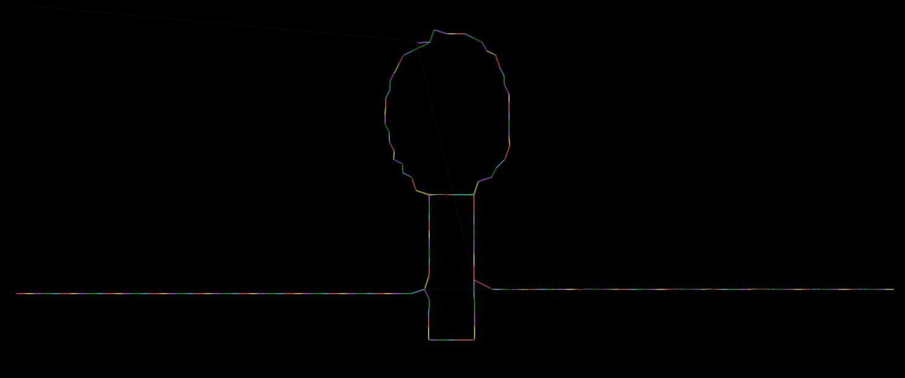
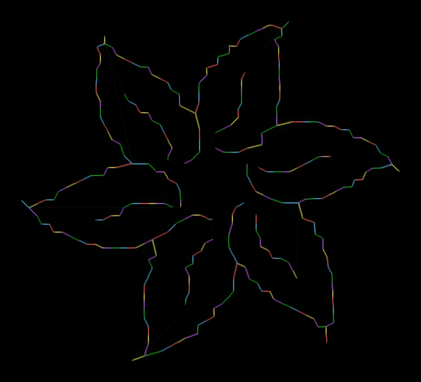

# Image to G-code converter

This repository contains a Python 3 script that takes an **image as input** and generates a **2D G-code file as output**. The script can either use the provided image as an edges image, or auto-detect the edges using the Sobel operator. Then a graph is built and it is converted to G-code. You can then **use the produced G-code in a 2D plotter**, you may find this other project of mine useful: [plotter](https://github.com/Stypox/plotter).

<table>
<tr>
<td colspan=2>Auto detecting edges</td>
<td colspan=2>Considering image as already edges</td>
</tr>
<tr>
<td></td>
<td></td>
<td></td>
<td></td>
</tr>
<tr>
<td colspan=4><sup>Obtained with <a href="http://jherrm.com/gcode-viewer/">http://jherrm.com/gcode-viewer/</a></sup></td>
</tr>
</table>

## Usage

You can run the script normally with [Python 3](https://www.python.org/downloads/):
```
python3 image_to_gcode.py ARGUMENTS...
```
This is the help screen with all valid arguments (obtainable with `python3 image_to_gcode.py --help`):
```
usage: image_to_gcode.py [-h] -i FILE -o FILE [--dot-output FILE] [-e MODE] [-t VALUE]

Detects the edges of an image and converts them to 2D gcode that can be printed by a plotter

optional arguments:
  -h, --help            show this help message and exit
  -i FILE, --input FILE
                        Image to convert to gcode; all formats supported by the Python imageio library are supported
  -o FILE, --output FILE
                        File in which to save the gcode result
  --dot-output FILE     Optional file in which to save the graph (in DOT format) generated during an intermediary step of gcode generation
  -e MODE, --edges MODE
                        Consider the input file already as an edges matrix, not as an image of which to detect the edges. MODE should be either `white` or `black`, that is the color of the edges in the image. The image should only be made of white or black pixels.
  -t VALUE, --threshold VALUE
                        The threshold in range (0,255) above which to consider a pixel as part of an edge (after Sobel was applied to the image or on reading the edges from file with the --edges option)
```

The required parameters are the input and the output. You may want to tune the threshold value in order to obtain a better graph.

An example of command is:
```sh
python3 image_to_gcode.py --input image.png --output graph.nc --threshold 100
```